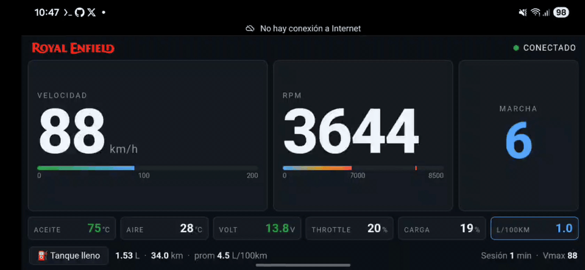

# RoyalEnfieldObd

A real-time OBD-II dashboard for Royal Enfield motorcycles[cite: 1]. Originally built for the **Interceptor 650**, now updated with full support for the **J-Series 350** (Classic/Bullet) and a localized English interface[cite: 1].

Reads live engine data from the bike's ECU through a WiFi ELM327 dongle and displays it on a mobile-friendly web dashboard[cite: 1].



## What it shows

- **Localized English UI**: All labels, alerts, and stats translated for global riders[cite: 1].
- **Engine Metrics**: RPM, speed, and estimated gear (calibrated for 5-speed and 6-speed gearboxes)[cite: 1].
- **Temperatures**: Engine oil temperature and intake air temperature[cite: 1].
- **Diagnostics**: Throttle position (TPS), MAP, engine load, and battery voltage[cite: 1].
- **Fuel Tracking**: Instantaneous consumption (L/100km) and tank-level tracking (calibrated for 13L/13.7L tanks)[cite: 1].
- **Session Stats**: Max speed, max RPM, duration, and fuel used per trip[cite: 1].
- **Persistence**: Lifetime odometer that persists across reboots[cite: 1].

## Hardware Support

| Component | Notes |
|---|---|
| **Royal Enfield J-Series 350** | Fully supported (Classic/Bullet 350)[cite: 1]. |
| **Royal Enfield 650 Twins** | Interceptor and Continental GT 650 supported out of the box[cite: 1]. |
| **ELM327 WiFi dongle** | Tested with Steren SCAN-030 and generic v1.5 clones[cite: 1]. |
| **Linux Host** | Raspberry Pi 3B or similar to run the backend and serve the UI[cite: 1]. |

> ⚠️ **Note**: Royal Enfield ECUs use a non-standard CAN protocol[cite: 1]. Only a subset of PIDs are accessible. For J-Series bikes, ensure your dongle supports **ISO 15765-4 CAN (11 bit, 500 kbaud)**[cite: 1].

## Calibrations Included

This fork includes specific profiles for:
- **J-Series 350 (Baron)**: 349cc displacement, 7000 RPM limit, 5-speed gear ratios[cite: 1].
- **650 Twins**: 648cc displacement, 8500 RPM limit, 6-speed gear ratios[cite: 1].

## Quick Start (Mock Mode)

Develop or test the UI without a real bike using synthetic data[cite: 1].

```bash
# Backend (terminal 1)
cd backend
pip install -r requirements.txt
MOCK_OBD=1 uvicorn main:app --reload --port 8000

# Frontend (terminal 2)
cd frontend
npm install
npm run dev
```

## Project Layout

- **backend/**: FastAPI server, OBD client, and calibrated PID decoders for 350/650 models[cite: 1].
- **frontend/**: Vue 3 dashboard localized in English (mobile-landscape layout)[cite: 1].

## Contributing

Contributions from the Royal Enfield family are welcome![cite: 1]. Whether you ride a Himalayan 450, a Shotgun, or a Hunter, feel free to share your gear ratios and PID notes via a PR[cite: 1].

---

**Original Project by David Moca** (Guatemala 🇬🇹)[cite: 1].
**Updated for J-Series 350 and English Localization by Medhansh Kabadwal**[cite: 1].

## License

[MIT](LICENSE) — Copyright (c) 2026.