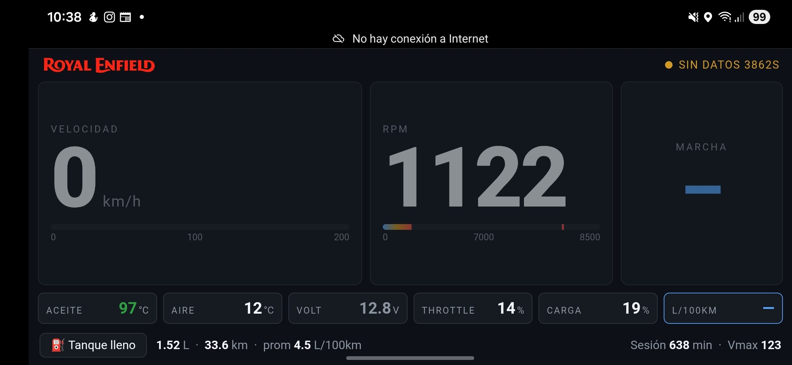

# RoyalEnfieldObd

A real-time OBD-II dashboard for the **Royal Enfield Interceptor 650**. Reads live engine data from the bike's ECU through a WiFi ELM327 dongle and displays it on a mobile-friendly web tablero.

Made with care in Guatemala 🇬🇹 by a rider, for riders.



## What it shows

- RPM, speed, and estimated gear
- Engine oil temperature, intake air temperature
- Throttle position, MAP, engine load
- Battery voltage
- Instantaneous fuel consumption (L/100km) and tank-level tracking
- Per-session stats: max speed, max RPM, total km, total fuel
- Lifetime odometer (persists across reboots)
- Alerts for over-temp, low voltage, etc.

## Hardware

| Component | Notes |
|---|---|
| Royal Enfield Interceptor 650 (2018+) | Continental GT 650 should work out of the box — same ECU and OBD wiring |
| ELM327 WiFi dongle | Tested with **Steren SCAN-030**. Most generic ELM327 v1.5 clones should work |
| Raspberry Pi 3B (or any Linux box) | Runs the backend + serves the frontend |
| Mobile device | Phone/tablet mounted on the handlebar to display the dashboard |

> ⚠️ The Interceptor 650 ECU does **not** speak full OBD-II. It uses a non-standard CAN protocol, and only a subset of PIDs are accessible. See `debug/CONTEXT_2.md` for the protocol notes.

## Architecture

```
[Bike ECU] ←(K-line)→ [ELM327 dongle] ←(WiFi)→ [Pi running backend] ←(HTTP)→ [Phone browser]
```

- **Backend** (`backend/`): FastAPI server. Polls the dongle at ~2 Hz over a TCP socket, decodes PIDs, exposes JSON at `/api/data`.
- **Frontend** (`frontend/`): Vue 3 + Vite SPA. Mobile-landscape layout optimized for being mounted on the bike.
- **Persistence**: lifetime odometer and tank state are stored in a JSON file so they survive reboots.

## Quick start (development, no bike required)

The backend has a **mock mode** that generates synthetic OBD data, so you can develop the frontend without a real bike or dongle.

```bash
# Backend (terminal 1)
cd backend
pip install -r requirements.txt
MOCK_OBD=1 uvicorn main:app --reload --port 8000

# Frontend (terminal 2)
cd frontend
npm install
npm run dev
```

Open <http://localhost:5173> in your browser. You should see fake data flowing in real time.

## Production setup (on a Raspberry Pi)

1. **Build the frontend:** `cd frontend && npm install && npm run build` — this produces `frontend/dist/`.
2. **Run the backend:** `cd backend && uvicorn main:app --host 0.0.0.0 --port 8000`. The backend serves the built frontend automatically.
3. **Connect the Pi to the dongle's WiFi AP** (typically named `Steren SCAN-030`, `WiFi_OBDII`, or similar — open network or default password `12345678`).
4. **Open `http://<pi-ip>:8000/` from your phone**, also connected to the dongle's WiFi.

A handful of env vars tune the behavior — see `backend/main.py` and `backend/obd.py` for details (e.g. `FUEL_CORRECTION_FACTOR`, `MOCK_OBD`).

## Project layout

```
backend/   FastAPI server, OBD client, PID decoders
frontend/  Vue 3 dashboard (mobile-landscape)
scripts/   Utilities (ride log analysis, backups)
debug/     Standalone diagnostic scripts and project notes
```

## Contributing

Contributions are very welcome — this started as a personal project but the community can make it much better.

- **Found a bug?** Open an issue with as much detail as possible (bike model/year, dongle model, log output if available).
- **Want to add a feature?** Open an issue first to discuss, then send a PR.
- **Ride a different Royal Enfield?** PRs adding support for other RE models (350, 450, Himalayan, etc.) are especially welcome — share your PIDs, gear ratios, and tire specs. This project is Royal Enfield–focused, so contributions stay within the RE family.
- **Don't speak English?** Issues and PRs in Spanish are perfectly fine — the maintainer is bilingual.

When developing, please use `MOCK_OBD=1` for changes that don't strictly require the real bike.

## License

[MIT](LICENSE) — Copyright (c) 2026 David Moca.

You are free to use, modify, and redistribute this project. Attribution to the original author is required.

## Acknowledgments

- The OBD-II / ELM327 community for decades of reverse-engineering work.
- The Royal Enfield 650 owner forums and Reddit threads that helped figure out the non-standard PIDs.
